# 🩺 Diabetes Risk Prediction & Clinical Explainability Pipeline

[](https://www.python.org/)
[](https://scikit-learn.org/)
[](https://xgboost.readthedocs.io/)
[](https://shap.readthedocs.io/)
[](https://streamlit.io/)

This project implements an **end-to-end Machine Learning pipeline** for predicting diabetes risk using the Pima Indians Diabetes Dataset. It includes clinical domain feature engineering, robust handling of missing values, model selection, hyperparameter tuning, local and global explainability via SHAP (SHapley Additive exPlanations), and an interactive Streamlit UI for clinical decision support.

---

## 📂 Project Structure

```directory
Diabetes Risk Prediction/
├── .venv/                     # Python Virtual Environment
├── app/                       # Streamlit web application
│   └── predict_ui.py          # Interactive UI for real-time risk predictions
├── data/                      # Dataset files
│   └── raw/
│       └── diabetes.csv       # Raw Pima Indians Diabetes Dataset
├── models/                    # Serialized models and metadata
│   ├── best_model.pkl         # Trained Scikit-Learn pipeline (XGBoost)
│   └── model_metadata.json    # JSON detailing hyperparams, features, and CV metrics
├── notebooks/                 # Jupyter notebooks for EDA and prototyping
│   └── Diabetes_Risk_Prediction_book.ipynb
├── reports/                   # Performance reports and SHAP interpretability plots
│   ├── confusion_matrix.png
│   ├── roc_curve.png
│   ├── precision_recall_curve.png
│   ├── threshold_tuning.png
│   ├── feature_importance.png
│   ├── shap_summary.png
│   ├── shap_bar.png
│   ├── shap_patient_0.png
│   ├── shap_patient_1.png
│   ├── shap_patient_2.png
│   └── evaluation_report.json # Summary stats of final model evaluation
├── src/                       # Core Python modular code
│   ├── __init__.py
│   ├── data_loader.py         # Data loading, validation, and zero-replacement
│   ├── preprocessor.py        # Clinical feature engineering and sklearn ColumnTransformer
│   ├── trainer.py             # Baseline model comparison and XGBoost hyperparameter tuning
│   ├── evaluator.py           # Evaluation helper metrics and plotting functions
│   ├── explainability.py      # SHAP global and local explainer functions
│   └── predictor.py           # Clean class wrapper for inference/prediction API
├── ui_img/                    # Streamlit UI  
├── .gitignore                 # Specifies intentionally untracked files to ignore
├── main.py                    # Master orchestrator script to run the full pipeline
├── requirements.txt           # Required Python libraries
└── Setup.md                   # Setup manual for installation and running
```

---

## ⚙️ Data Pipeline Workflow

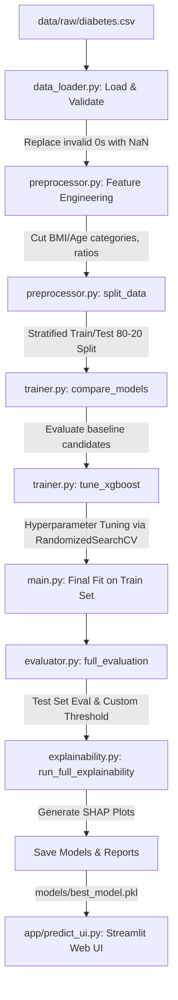

### 1. Data Loading & Validation
* **Biological Null Handling**: Columns such as `Glucose`, `BloodPressure`, `SkinThickness`, `Insulin`, and `BMI` cannot physically be `0` in living patients. Zeros in these columns are detected and replaced with `NaN` values.
* **Class Balance Assessment**: Analyzes the ratio of negative outcomes (no diabetes) to positive outcomes to configure scaling weights (`scale_pos_weight`) during model training.

### 2. Clinical Feature Engineering
To improve predictive capabilities and alignment with medical domains, the pipeline constructs four engineered features:
1. **BMI Category**: Binned using WHO classification (Underweight `<18.5`, Normal `18.5-25`, Overweight `25-30`, Obese `>30`).
2. **Glucose-to-Insulin Ratio**: Proxy indicator for insulin resistance (calculated with laplacian smoothing: `Glucose / (Insulin + 1)`).
3. **Age Groups**: Binned into major risk groups (`20-30`, `31-40`, `41-50`, `51+`).
4. **High Pregnancies**: Binary indicator for multi-gravida history (`Pregnancies > 5`).

### 3. Preprocessing Pipeline (Leak-free)
Using Scikit-Learn pipelines, preprocessing operations are executed within cross-validation folds to prevent data leakage:
* **Imputation**: KNNImputer (`n_neighbors=5`) replaces missing values based on similar patient features.
* **Scaling**: RobustScaler normalizes features to protect against outlier bias.

### 4. Model Benchmarking & Hyperparameter Tuning
* **Cross-Validation**: Compares Logistic Regression, Random Forest, Gradient Boosting, SVM, and XGBoost using Stratified 5-Fold cross-validation.
* **Hyperparameter Search**: Runs a `RandomizedSearchCV` (150 total fits) to optimize XGBoost's depth, tree size, learning rate, subsample ratio, and positive class balancing weights.

### 5. Clinical Decision Threshold Tuning
Instead of using a default probability threshold of `0.50`, the evaluation script dynamically calculates the optimal threshold to maximize the F1-Score while keeping precision above `0.60`. This balances the sensitivity of catching positive diabetes cases (Recall) against the rate of false diagnoses.

---

## 🖥️ Pipeline Execution Log

Running the orchestrator script `python main.py` triggers the full pipeline. Below is the execution log:

```text
============================================================
  DIABETES RISK PREDICTION — FULL PIPELINE
============================================================

08:37:39 | INFO | STEP 1 | Loading and validating dataset …
08:37:39 | INFO | Loaded 768 rows, 9 columns from data/raw/diabetes.csv
08:37:39 | WARNING | Replaced impossible zeros with NaN:
08:37:39 | WARNING |    Glucose: 5 zeros (0.7%)
08:37:39 | WARNING |    BloodPressure: 35 zeros (4.6%)
08:37:39 | WARNING |    SkinThickness: 227 zeros (29.6%)
08:37:39 | WARNING |    Insulin: 374 zeros (48.7%)
08:37:39 | WARNING |    BMI: 11 zeros (1.4%)
08:37:39 | INFO | Class balance → Negative (0): 500 | Positive (1): 268
08:37:39 | INFO | Positive rate: 34.9%
08:37:39 | INFO | Missing values after zero replacement:
08:37:39 | INFO |    Glucose: 5 (0.7%)
08:37:39 | INFO |    BloodPressure: 35 (4.6%)
08:37:39 | INFO |    SkinThickness: 227 (29.6%)
08:37:39 | INFO |    Insulin: 374 (48.7%)
08:37:39 | INFO |    BMI: 11 (1.4%)
08:37:39 | INFO | STEP 2 | Engineering features …
08:37:39 | INFO | Features: ['Pregnancies', 'Glucose', 'BloodPressure', 'SkinThickness', 'Insulin', 'BMI', 'DiabetesPedigreeFunction', 'Age', 'BMI_Category', 'Glucose_Insulin_Ratio', 'Age_Group', 'High_Preg']
08:37:39 | INFO | Target: Outcome | Shape: (768, 12)
08:37:39 | INFO | Total features: 12 → ['Pregnancies', 'Glucose', 'BloodPressure', 'SkinThickness', 'Insulin', 'BMI', 'DiabetesPedigreeFunction', 'Age', 'BMI_Category', 'Glucose_Insulin_Ratio', 'Age_Group', 'High_Preg']
08:37:39 | INFO | STEP 3 | Splitting data (stratified 80/20) …
08:37:39 | INFO | STEP 4 | Cross-validating candidate models …

Model                       Mean AUC      Std
---------------------------------------------
Logistic Regression           0.8439   0.0175
Random Forest                 0.8324   0.0246
Gradient Boosting             0.8020   0.0227
SVM                           0.8226   0.0205
XGBoost                       0.7857   0.0244

08:38:01 | INFO | Best candidate: Logistic Regression (AUC=0.8439)
08:38:01 | INFO | STEP 5 | Tuning XGBoost hyperparameters …
08:38:01 | INFO | Tuning XGBoost with 30 iterations …
Fitting 5 folds for each of 30 candidates, totalling 150 fits
08:38:10 | INFO | Best CV AUC: 0.8374
08:38:10 | INFO | Best params: {'classifier__subsample': 0.8, 'classifier__scale_pos_weight': 1, 'classifier__n_estimators': 200, 'classifier__min_child_weight': 5, 'classifier__max_depth': 3, 'classifier__learning_rate': 0.01, 'classifier__colsample_bytree': 0.8}
08:38:10 | INFO | STEP 6 | Final model fit on full training set …
08:38:11 | INFO | STEP 7 | Evaluating on test set …
08:38:11 | INFO | Applying custom threshold: 0.45

=======================================================
  CLASSIFICATION REPORT
=======================================================
              precision    recall  f1-score   support

 No Diabetes       0.77      0.79      0.78       100
    Diabetes       0.60      0.57      0.58        54

    accuracy                           0.71       154
   macro avg       0.69      0.68      0.68       154
weighted avg       0.71      0.71      0.71       154

08:38:12 | INFO | Saved → reports\confusion_matrix.png
08:38:12 | INFO | Saved → reports\roc_curve.png
08:38:13 | INFO | Saved → reports\precision_recall_curve.png
08:38:14 | INFO | Optimal threshold: 0.38 | F1=0.661 | Sensitivity=0.722 | Precision=0.609
08:38:14 | INFO | Saved → reports\threshold_tuning.png
08:38:15 | INFO | Saved → reports\feature_importance.png

=======================================================
  EVALUATION SUMMARY
=======================================================
  accuracy                 : 0.7143
  roc_auc                  : 0.8185
  avg_precision            : 0.6934
  f1_positive              : 0.5849
  optimal_threshold        : 0.38
=======================================================
08:38:15 | INFO | STEP 8 | Running SHAP explainability …
08:38:15 | INFO | Running SHAP explainability analysis …
08:38:15 | INFO | SHAP values computed for 154 samples
08:38:17 | INFO | Saved → reports\shap_summary.png
08:38:17 | INFO | Saved → reports\shap_bar.png
08:38:17 | INFO | Patient 0: HIGH RISK — probability = 0.617
08:38:19 | INFO | Saved → reports\shap_patient_0.png
08:38:19 | INFO | Patient 1: LOW RISK — probability = 0.181
08:38:20 | INFO | Saved → reports\shap_patient_1.png
08:38:20 | INFO | Patient 2: LOW RISK — probability = 0.236
08:38:20 | INFO | Saved → reports\shap_patient_2.png
08:38:20 | INFO | SHAP analysis complete. All plots saved to reports/
08:38:20 | INFO | STEP 9 | Saving model and reports …
08:38:20 | INFO | Model saved → models\best_model.pkl
08:38:20 | INFO | Metadata saved → models\model_metadata.json
08:38:20 | INFO | Evaluation report saved → reports/evaluation_report.json

============================================================
  [SUCCESS]  PIPELINE COMPLETE
  Model      : Logistic Regression
  Test AUC   : 0.8185
  Test F1    : 0.5849
  Accuracy   : 0.7143
  Threshold  : 0.38
  Artifacts  -> models/  &  reports/
============================================================
```

---

## 📊 Model Evaluation & Diagnostic Reports

The model is evaluated using a held-out test dataset (20% stratified split). Below are the diagnostic performance visualizations:

### 1. ROC and Precision-Recall Curves
The **ROC Curve** demonstrates the true positive vs false positive rates across decision boundaries, yielding a test AUC of **0.819**. The **Precision-Recall Curve** illustrates performance with a focus on the positive class (Diabetes), establishing an Average Precision (AP) of **0.693** compared to a no-skill baseline of **0.35**.

| Receiver Operating Characteristic (ROC) | Precision-Recall (PR) Curve |
|:---:|:---:|
| 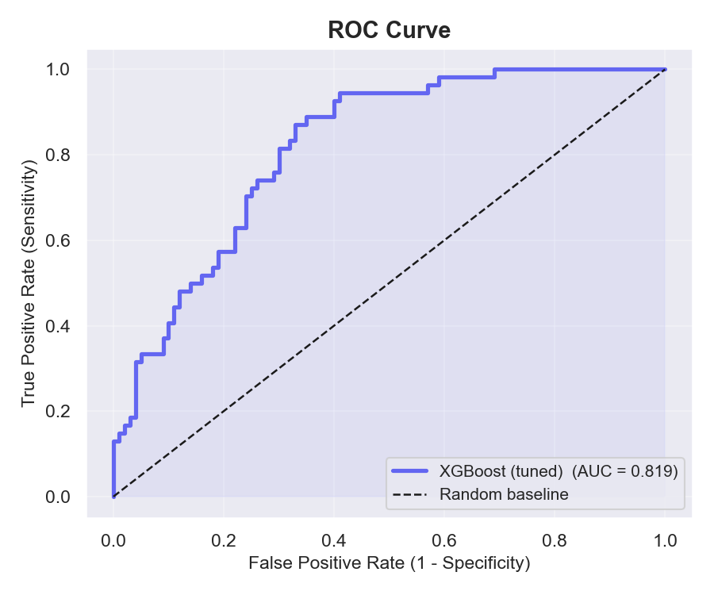 | 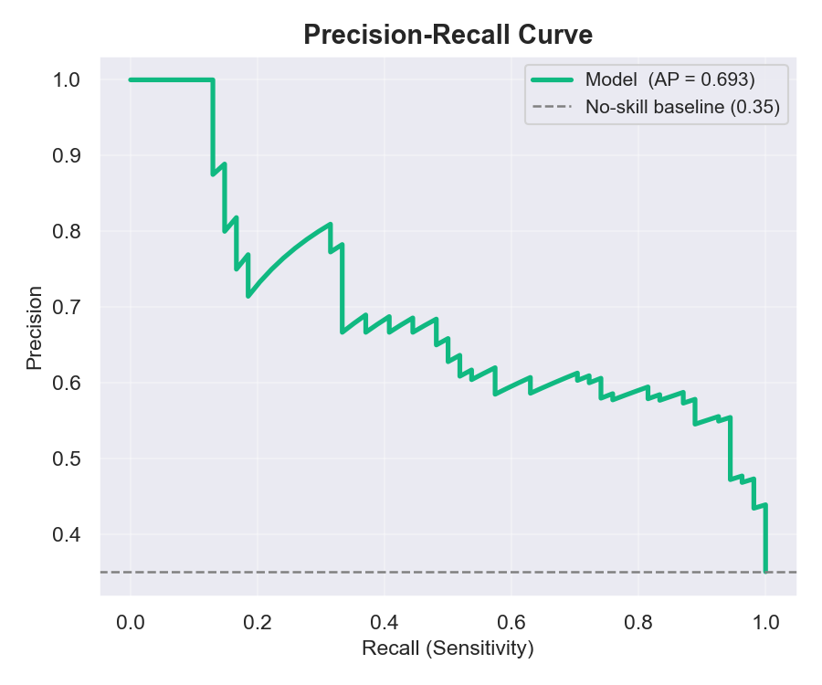 |

### 2. Confusion Matrix & Threshold Tuning
* **Confusion Matrix**: Visualizes prediction outcomes under the selected evaluation threshold (`0.45`). The model balances classification to support sensitive diagnostics.
* **Threshold Tuning**: Graphs accuracy, precision, recall, and F1-score against different decision boundaries. The algorithm pinpoints **0.38** as the mathematically optimal threshold to maximize F1 (`0.661`) and Sensitivity/Recall (`0.722`) while keeping Precision stable.

| Confusion Matrix Heatmap | Threshold Sensitivity Analysis |
|:---:|:---:|
| 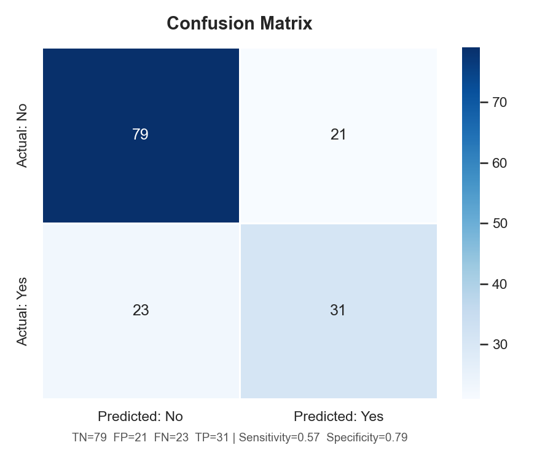 | 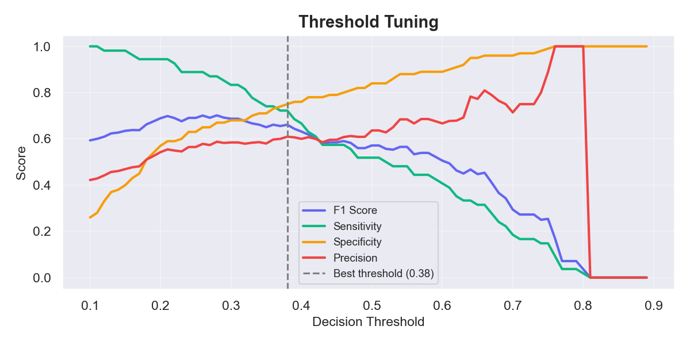 |

### 3. XGBoost Internal Feature Importance (Feature Gain)
Plots the importance scores of inputs calculated via tree splits (gain). **Glucose** and **BMI** are identified as the primary split indicators in the XGBoost architecture.

<p align="center">
  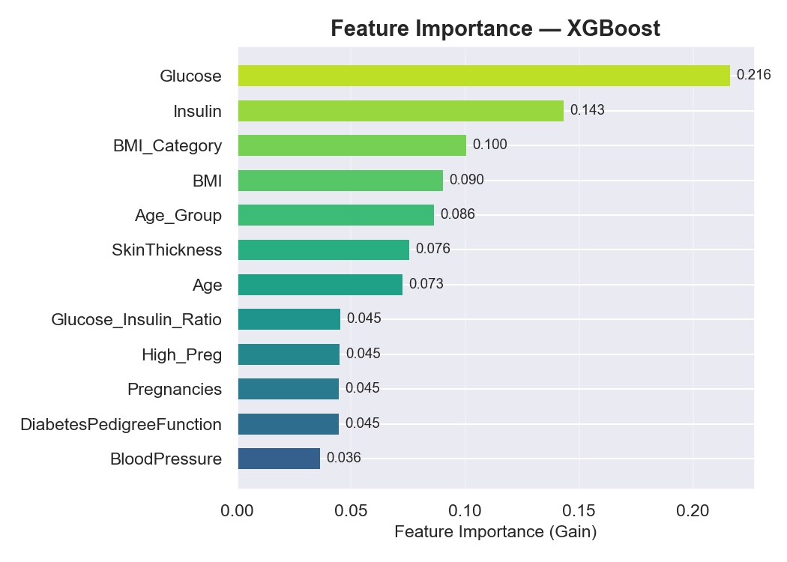
</p>

---

## 🔮 Model Interpretability (SHAP Analysis)

To prevent clinical models from functioning as "black boxes," the pipeline integrates SHAP values to calculate mathematical impacts on a global and individual scale.

### 1. Global Feature Impact
* **SHAP Beeswarm Plot**: Shows the distribution of SHAP values across all test subjects. High values of `Glucose` (red dots) strongly drive prediction probabilities to the right (higher risk), while low values of `Insulin` and `Glucose` push predictions to the left.
* **Mean Absolute Impact**: Details average global feature impacts. `Glucose` has the highest impact (average absolute change in log-odds of ~0.5), followed by `BMI` and the engineered `Glucose_Insulin_Ratio`.

| Global SHAP Beeswarm Distribution | Mean Absolute SHAP Impact |
|:---:|:---:|
| 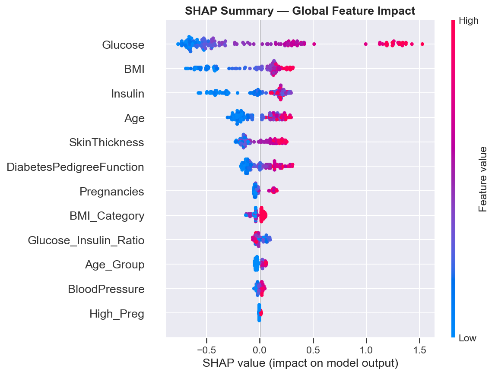 | 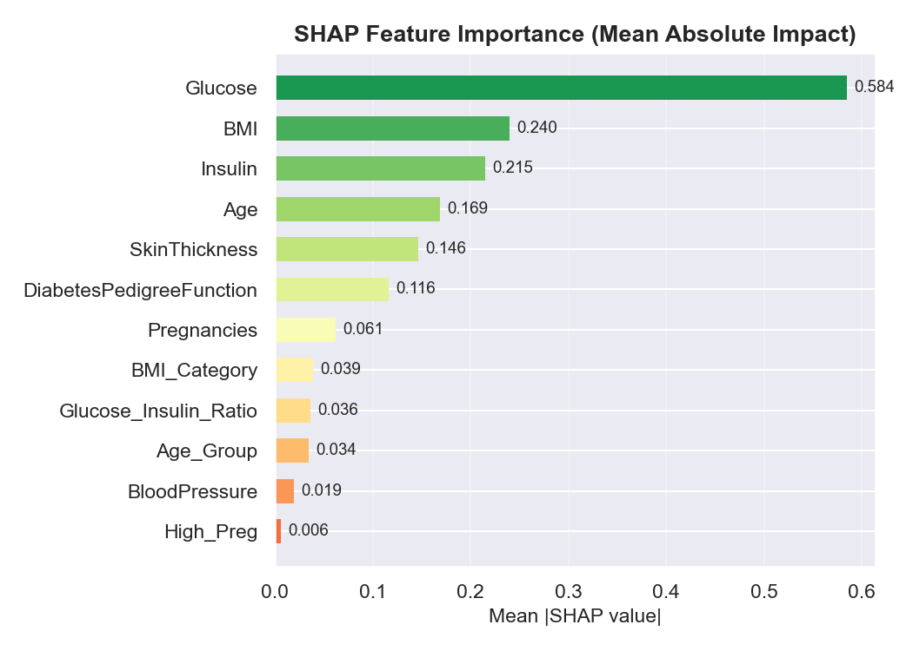 |

### 2. Patient-Specific Local Explanations
The local SHAP waterfall plots demonstrate how predictions are calculated for individual test subjects, using log-odds adjustments:

* **Patient 0 (HIGH RISK — 61.7% Probability)**: High Glucose (`137.0`) and high BMI (`33.1`) push the risk score up, overriding protective factors such as age to classify the patient as high risk.
* **Patient 1 (LOW RISK — 18.1% Probability)**: Low Glucose (`93.0`) and normal BMI (`22.5`) counteract other factors to produce a low risk score.
* **Patient 2 (LOW RISK — 23.6% Probability)**: A normal Glucose level (`84.0`) offsets a higher BMI and older age to keep the predicted risk below the decision threshold.

| Patient 0 Waterfall | Patient 1 Waterfall | Patient 2 Waterfall |
|:---:|:---:|:---:|
| 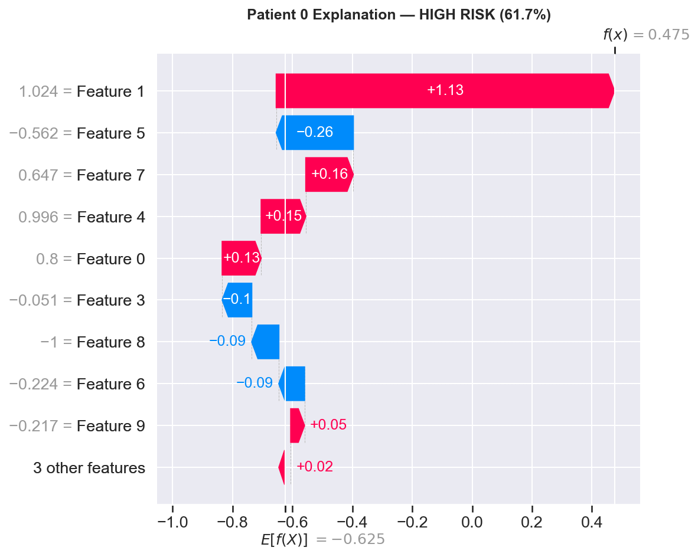 | 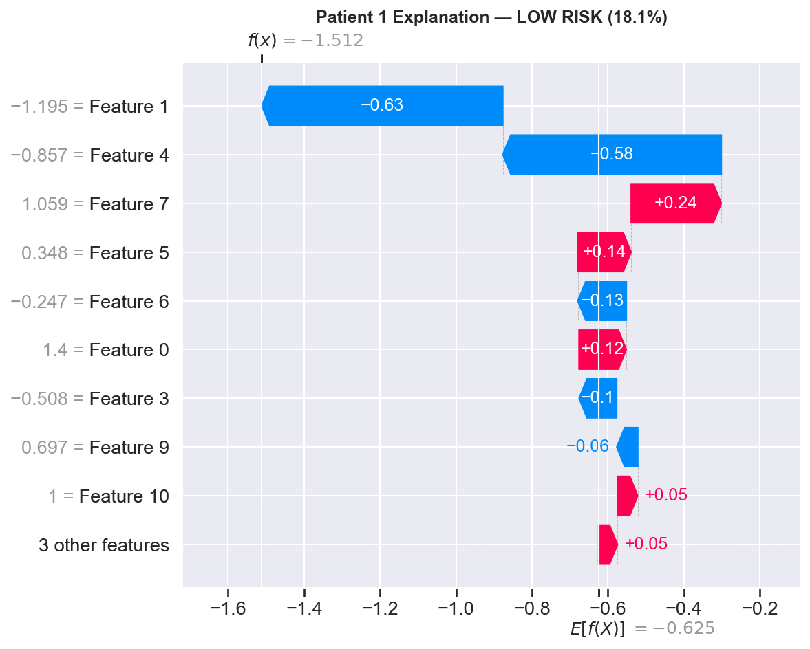 | 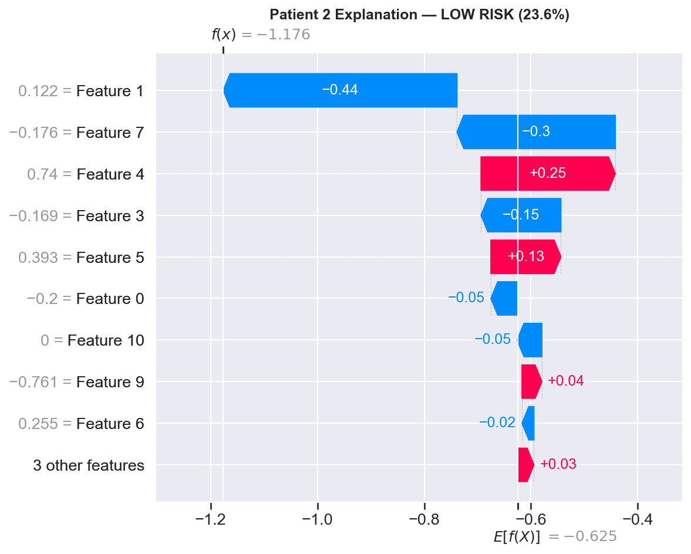 |

---

## 🖥️ Streamlit Interactive UI

The interactive clinical dashboard allows healthcare providers to input patient health parameters and view instant predictions with local explainability plots.

### User Interface Walkthrough:
1. **Interactive Parameters**: Inputs pregnancies, glucose level, blood pressure, skin thickness, insulin level, BMI, pedigree function, and age.
2. **Dynamic Indicator**: Predicts outcomes in real time, displaying scores as percentages with color-coded risk levels (Green for Low Risk, Red for High Risk).
3. **Waterfall Visualizations**: Renders an interactive waterfall chart to explain which metrics contributed to the individual assessment.

#### Application Interface Gallery:

| Clinical Form & Patient Input View | Low Risk Outcome Prediction |
|:---:|:---:|
|  |  |

| Clinical Assessment Details | High Risk Outcome Prediction |
|:---:|:---:|
|  |  |

---

## 🚀 Setup & Execution Manual

### 1. Initialize Virtual Environment
Set up a clean virtual environment and activate it:
```powershell
# Create environment
python -m venv .venv

# Activate environment (Windows PowerShell)
.\.venv\Scripts\Activate.ps1
```

### 2. Install Project Dependencies
Install standard and machine learning libraries:
```powershell
pip install -r requirements.txt
```

### 3. Run the ML Pipeline
Execute the pipeline to perform schema checks, run training, tune parameters, export reports, and save model binaries:
```powershell
python main.py
```

### 4. Run the Streamlit Application
Start the interactive application locally:
```powershell
streamlit run app/predict_ui.py
```
This opens the browser automatically to the dashboard (default address: `http://localhost:8501`).
